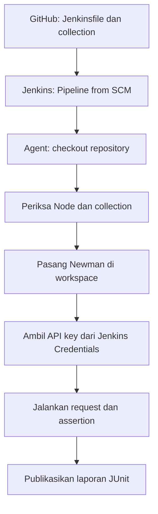

# Mini project Jenkins + Newman + ReqRes: panduan dan troubleshooting

> [!info] Status pembelajaran — 29 September 2026
> Collection sudah berhasil dijalankan manual, melalui cron Linux, dan melalui **Jenkins Pipeline**. Pipeline Jenkins terbaru di branch `main` sudah memuat perbaikan untuk instalasi Newman pada agent dan perintah Newman yang sempat tersambung keliru. **Jadwal Jenkins masih dikomentari** dalam Jenkinsfile yang diperiksa; aktifkan hanya bila ingin build otomatis.

## 1. Gambaran alur



**Peran masing-masing komponen:**

| Komponen | Fungsi |
| --- | --- |
| Postman Collection | Menyimpan 8 request ReqRes dan assertion-nya. |
| Newman | Menjalankan collection melalui CLI. |
| GitHub | Menyimpan Jenkinsfile dan collection agar Jenkins mengambil versi yang telah di-push. |
| Jenkins controller | Mengatur job, credential, build, dan jadwal. |
| Jenkins agent `jenkins-agent-01` | Menjalankan shell, npm, Newman, dan request API. |
| Jenkins Credentials | Menyimpan API key sebagai **Secret text** ber-ID `reqres-api-key`. |
| JUnit report | Menampilkan hasil tes di halaman build Jenkins. |

API key tidak ditaruh di GitHub atau Jenkinsfile. Job Jenkins juga **tidak memakai** file `$HOME/.config/newman/reqres.env` milik percobaan cron Linux.

## 2. Susunan repository

Repository: [rikofirnando/newman-reqres-mini-project](https://github.com/rikofirnando/newman-reqres-mini-project), branch `main`.

```text
newman-reqres-mini-project/
├── Jenkinsfile
└── postman/
    └── reqres.collection.json
```

Nama file dan path di repo harus sama dengan path dalam Jenkinsfile: `postman/reqres.collection.json`. Data sensitif dan hasil build tidak perlu di-commit. Jika belum ada, tambahkan `.gitignore`:

```gitignore
.newman-tools/
reports/
logs/
cron.log
*.env
```

> [!warning] Sebelum `git add .`
> Jalankan `git status --short` untuk memastikan file key dan laporan lokal tidak ikut masuk commit. `.gitignore` tidak menghapus file yang sudah telanjur dilacak Git.

### Kendala awal: `src refspec main does not match any`

Saat itu branch lokal masih `master`, tetapi perintahnya `git push origin main`. Git mencari branch lokal bernama `main` dan tidak menemukannya. Setelah memastikan commit sudah ada, ubah nama branch dan push:

```bash
git branch --show-current
git status --short
git branch -M main
git push -u origin main
```

Jika belum ada commit, lakukan `git add` untuk file yang aman, `git commit`, lalu push. `git push` hanya mengirim **commit**, bukan perubahan file yang belum di-commit.

## 3. Siapkan agent Jenkins

Pastikan node berlabel `jenkins-agent-01` aktif di **Manage Jenkins → Nodes**. Pada build yang berhasil diperbaiki, agent menyediakan:

```text
Node.js: v20.18.1
npm: 9.2.0
Newman: 6.2.2 (dipasang oleh pipeline di workspace)
```

Lokasi Node/Newman pada terminal login `rikofirnando` tidak harus sama dengan lokasi yang tersedia bagi proses Jenkins. Pipeline sekarang menggunakan `npm install --prefix .newman-tools ...` untuk memasang Newman di workspace job, lalu memanggil `.newman-tools/node_modules/.bin/newman` secara langsung.

Agent memerlukan akses ke npm registry saat memasang paket dan akses ke `https://reqres.in` saat menjalankan tes. Jika ingin instalasi lebih cepat di masa depan, barulah pertimbangkan Jenkins NodeJS tool atau instalasi Newman terkelola pada agent; untuk latihan ini, instalasi per workspace lebih mudah dilacak.

## 4. Buat credential API key

1. Buka **Manage Jenkins → Credentials**.
2. Pilih domain global atau folder tempat job dapat mengakses credential → **Add Credentials**.
3. **Kind:** `Secret text`.
4. **Secret:** API key ReqRes yang aktif.
5. **ID:** `reqres-api-key` (harus identik dengan Jenkinsfile).
6. Simpan.

Kode `withCredentials([string(...)])` menyediakan key sebagai variabel `REQRES_API_KEY` hanya selama stage pengujian. `set +x` mencegah shell menampilkan perintah beserta argumennya. Jangan mencetak key dengan `echo`, `env`, atau log debug. Key yang pernah terpapar di percakapan sebaiknya telah diganti.

## 5. Buat job Pipeline from SCM

1. Di Dashboard Jenkins, klik **New Item**.
2. Isi nama, misalnya `Learn Newman ReqRes` → pilih **Pipeline** → **OK**.
3. Di bagian **Pipeline**, pilih **Definition: Pipeline script from SCM**.
4. Pilih **Git**, lalu isi URL repository: `https://github.com/rikofirnando/newman-reqres-mini-project.git`.
5. Isi credential Git jika akses repository memerlukannya.
6. **Branches to build:** `*/main`.
7. **Script Path:** `Jenkinsfile` → **Save**.

Karena Jenkinsfile dibaca dari Git, setiap perbaikan lokal memerlukan `git add`, `git commit`, dan `git push` sebelum tombol **Build Now** memakai perubahan tersebut.

## 6. Jenkinsfile yang sedang dipakai

Berikut isi Jenkinsfile pada branch `main` saat catatan ini dibuat:

```groovy
pipeline {
    agent { label 'jenkins-agent-01' }

    options {
        skipDefaultCheckout(true)
        disableConcurrentBuilds()
        buildDiscarder(logRotator(numToKeepStr: '14'))
    }

    // Aktifkan setelah Build Now berhasil. Jam mengikuti zona waktu Jenkins controller.
    // triggers { cron('H 8 * * *') }

    stages {
        stage('Checkout') {
            steps {
                checkout scm
            }
        }

        stage('Check Newman') {
            steps {
                sh '''#!/usr/bin/env bash
set -Eeuo pipefail
node --version
npm --version
test -f postman/reqres.collection.json
'''
            }
        }

        stage('Install Newman') {
            steps {
                sh '''#!/usr/bin/env bash
set -Eeuo pipefail
npm install --prefix .newman-tools --no-save --no-package-lock --no-audit --no-fund newman@6.2.2
.newman-tools/node_modules/.bin/newman --version
'''
            }
        }

        stage('Run API Tests') {
            steps {
                withCredentials([string(credentialsId: 'reqres-api-key', variable: 'REQRES_API_KEY')]) {
                    sh '''#!/usr/bin/env bash
set -Eeuo pipefail
set +x
umask 077
mkdir -p reports

.newman-tools/node_modules/.bin/newman run postman/reqres.collection.json \
  --env-var "api_key=$REQRES_API_KEY" \
  --reporters cli,junit \
  --reporter-junit-export reports/newman.xml \
  --timeout-request 30000
'''
                }
            }
        }
    }

    post {
        always {
            script {
                if (fileExists('reports/newman.xml')) {
                    junit testResults: 'reports/newman.xml'
                }
            }
        }
    }
}
```

Another version

```
pipeline {
    agent none

    options {
        disableConcurrentBuilds()
        buildDiscarder(logRotator(numToKeepStr: '14'))
    }

    stages {
        stage('Newman API Test') {
            agent { label 'jenkins-agent-01' }

            options {
                skipDefaultCheckout(true)
            }

            steps {
                checkout scm

                echo '========================================'
                echo 'MENJALANKAN API TEST MENGGUNAKAN NEWMAN'
                echo '========================================'
                echo "Job Name     : ${env.JOB_NAME}"
                echo "Build Number : ${env.BUILD_NUMBER}"
                echo "Node         : ${env.NODE_NAME}"
                echo "Workspace    : ${env.WORKSPACE}"

                sh '''#!/usr/bin/env bash
set -Eeuo pipefail

echo 'Node.js version:'
node --version
echo 'NPM version:'
npm --version

test -f postman/reqres.collection.json

npm install --prefix .newman-tools \
  --no-save --no-package-lock --no-audit --no-fund \
  newman@6.2.2

.newman-tools/node_modules/.bin/newman --version
mkdir -p newman
'''

                withCredentials([
                    string(credentialsId: 'reqres-api-key', variable: 'REQRES_API_KEY')
                ]) {
                    sh '''#!/usr/bin/env bash
set -Eeuo pipefail
set +x
umask 077

.newman-tools/node_modules/.bin/newman run postman/reqres.collection.json \
  --env-var "api_key=$REQRES_API_KEY" \
  --reporters cli,junit \
  --reporter-junit-export newman/results.xml \
  --timeout-request 30000
'''
                }
            }

            post {
                always {
                    script {
                        if (fileExists('newman/results.xml')) {
                            junit testResults: 'newman/results.xml'
                        }
                    }
                }

                success {
                    echo 'Newman API Test berhasil'
                }

                failure {
                    echo 'Newman API Test gagal. Periksa Console Output.'
                }
            }
        }
    }

    post {
        always {
            echo "Status akhir Pipeline: ${currentBuild.currentResult}"
        }
    }
}
```

### Apa yang dilakukan tiap stage?

1. **Checkout:** `checkout scm` mengambil branch yang dipilih di job.
2. **Check Newman:** mengecek versi Node/npm dan memastikan collection ada. Nama stage berasal dari versi awal; kini belum memeriksa Newman sampai stage berikutnya.
3. **Install Newman:** memasang Newman `6.2.2` ke `.newman-tools` dalam workspace Jenkins. Peringatan `npm WARN deprecated` dari dependency **bukan otomatis penyebab build gagal** bila npm tetap selesai dengan exit code `0`.
4. **Run API Tests:** membaca credential, menjalankan collection, dan membuat `reports/newman.xml`.
5. **Post:** bila XML tersedia, Jenkins memprosesnya menjadi **Test Result**. Jika Newman gagal sebelum membuat XML, lihat **Console Output**.

`disableConcurrentBuilds()` mencegah build job yang sama bertumpuk; `buildDiscarder` membatasi jumlah riwayat build. `--timeout-request 30000` membatasi satu request ke 30 detik. Perintah Newman mengembalikan exit code gagal ketika ada kegagalan pengujian.

## 7. Jalankan dan periksa hasil

1. Klik **Build Now** pada job.
2. Buka nomor build terbaru → **Console Output**.
3. Periksa urutan stage: Checkout → Check Newman → Install Newman → Run API Tests → Post.
4. Pastikan versi Newman `6.2.2` tampil, request ke ReqRes dieksekusi, dan ringkasan assertion tidak menunjukkan kegagalan.
5. Buka **Test Result** pada halaman build untuk melihat tes JUnit. Laporan XML berada di workspace sementara build berlangsung; Jenkins menyimpan hasil yang dipublikasikan sebagai bagian dari build.

Jika collection berubah, commit dan push terlebih dahulu, lalu Build Now lagi. Jangan menilai perubahan dari file lokal yang belum dikirim ke branch `main`.

## 8. Aktifkan jadwal di Jenkins

Saat ini baris `triggers` masih dikomentari. Setelah build manual sukses, ubah:

```groovy
// triggers { cron('H 8 * * *') }
```

menjadi:

```groovy
triggers { cron('H 8 * * *') }
```

Commit dan push, lalu jalankan **Build Now** sekali supaya Jenkins membaca revisi Jenkinsfile. `H 8 * * *` berarti **sekali sehari pada menit pilihan Jenkins antara 08:00–08:59**, berdasarkan zona waktu Jenkins controller; bukan selalu tepat 08:00. Untuk tepat 08:00 pada zona waktu controller gunakan `0 8 * * *`. Periksa zona waktu controller sebelum menyebutnya 08:00 WIB.

Untuk latihan pemicu otomatis, sementara gunakan `H/5 * * * *`, tunggu satu build terjadwal, lalu **kembalikan** ke jadwal harian. Jika cron Linux masih aktif, ingat keduanya scheduler terpisah dan dapat menjalankan tes dua kali.

## 9. Troubleshooting yang benar-benar terjadi

### A. `newman: command not found` pada stage Jenkins

**Gejala:** stage menampilkan `Node: v20.18.1`, lalu `newman: command not found` dan build selesai dengan exit code `127`.

**Penyebab:** Jenkinsfile awal menambahkan path `/home/rikofirnando/.nvm/versions/node/v24.18.0/bin`, yaitu instalasi pada terminal pribadi, sementara agent Jenkins berjalan dengan Node `v20.18.1`. Newman tidak tersedia di PATH yang dipakai proses Jenkins. Perintah `echo "Newman: $(newman --version)"` bahkan bisa mencetak `Newman:` kosong sambil menyembunyikan kegagalan command substitution dalam `echo`.

**Perbaikan:** stage **Install Newman** memasang paket ke workspace dan stage tes menjalankan executable melalui path `.newman-tools/node_modules/.bin/newman`. Verifikasi `node --version` dan `npm --version` tetap pada stage awal.

### B. `error: unknown option '-p'` saat `Run API Tests`

**Gejala:** instalasi selesai (`added 148 packages`, Newman `6.2.2`), tetapi stage tes gagal dengan `unknown option '-p'`.

**Penyebab:** edit Jenkinsfile sempat menghasilkan:

```bash
.newman-tools/node_modules/.bin/newman run postman/reqres.collection.json \
mkdir -p reports
newman run postman/reqres.collection.json \
```

Karakter `\` pada akhir baris menyambung baris selanjutnya. Shell menafsirkan `mkdir -p reports` sebagai argumen tambahan untuk Newman, sehingga `-p` ditolak. Perintah `newman run` juga terduplikasi.

**Perbaikan:** `mkdir -p reports` berdiri sendiri **sebelum** satu perintah Newman. Opsi Newman ditulis sebagai kelanjutan dari perintah tersebut. Lihat stage **Run API Tests** pada Jenkinsfile di atas.

### C. `npm WARN deprecated ...`

Itu peringatan dari dependency Newman. Dalam build yang dilaporkan, instalasi tetap selesai dan `newman --version` menunjukkan `6.2.2`. Fokuskan diagnosis pada baris **error** dan exit code, bukan memperlakukan setiap WARN sebagai kegagalan.

### D. Error lain yang perlu dicek

| Gejala | Langkah cek |
| --- | --- |
| Menunggu agent terus | Cek status dan label `jenkins-agent-01` di **Manage Jenkins → Nodes**. |
| `npm: command not found` | Node/npm harus tersedia untuk akun proses pada agent Jenkins. |
| `test -f ...` gagal | Pastikan file ada di branch `main`, path tepat, commit sudah di-push, dan checkout mengambil commit terbaru. |
| Credential tidak ditemukan | Periksa ID `reqres-api-key`, jenis **Secret text**, dan scope yang dapat diakses job. |
| HTTP 401/403 dari ReqRes | Periksa key aktif dan hak akses dari agent; jangan tampilkan nilai key di Console Output. |
| Test Result tidak muncul | Lihat apakah `reports/newman.xml` tercipta; kegagalan sebelum reporter menulis XML terlihat di Console Output. |
| Job tidak terpicu otomatis | Pastikan baris `triggers` sudah diaktifkan, perubahan di-push, Jenkins membaca Jenkinsfile terbaru, dan zona waktu controller sesuai. |

## 10. Checklist akhir pembelajaran

- [x] Collection berjalan manual dengan Newman.
- [x] Credential API key disimpan di Jenkins, bukan Git.
- [x] Jenkins mengambil Jenkinsfile dan collection dari branch `main`.
- [x] Newman tersedia dalam workspace agent.
- [x] Perintah Newman tidak lagi memiliki `mkdir -p` sebagai argumen.
- [x] Build Jenkins berhasil menurut konfirmasi praktik.
- [ ] Timer Jenkins diaktifkan dan diuji, **jika ingin menjalankan otomatis**.

## Referensi

- [Repository mini project](https://github.com/rikofirnando/newman-reqres-mini-project)
- [Jenkins: Pipeline syntax](https://www.jenkins.io/doc/book/pipeline/syntax/)
- [Jenkins: Using credentials](https://www.jenkins.io/doc/book/using/using-credentials/)
- [Jenkins: Recording tests and artifacts](https://www.jenkins.io/doc/pipeline/tour/tests-and-artifacts/)
- [Postman: Install and run Newman](https://learning.postman.com/docs/reference/newman-cli/installing-running-newman/)
